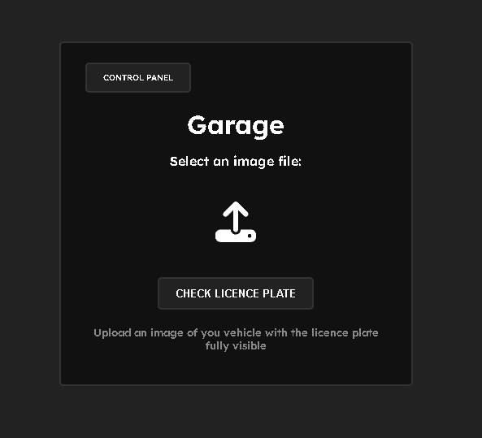

# garage-system

This project has two backbones:

> [YoloV5](https://github.com/ultralytics/yolov5)

> [EasyOCR](https://github.com/JaidedAI/EasyOCR)

the **YoloV5** model was trained on a custom **[dataset](https://www.kaggle.com/datasets/andrewmvd/car-plate-detection)**, and it is used for
detecting licence plates on the provided image. For extracting the text from the image [EasyOCR](https://github.com/JaidedAI/EasyOCR) is used.
Which is then sent to the backend of the http server and checked against the database if the provided car aka its licence plate has access to the garage system

# api

The basic way to check an if the car has access to the garage is to start the http server aka run the ```system/server.py``` and upload
the image that you wish to check through the ui on the website

### backend

The server offsets a different way of checking the licence plate if dont wish to use the graphical interface.
<br>
It has an API that can be accessed by sending a **POST** request to ```localhost:6060/check```
<br>

Body of the request has to contain an image file. that image file is then processed and checked against
the database for access.

***Response***

If the plate has been authenticated the response of the request will look something like this:

```json
{
  "first_name": "John",
  "last_name": "Doe",
  "plate_text": "HR 221-LD"
}
```

In the case that the plate has failed to authenticate the response will look like this:

```json
{
  "error": "You don't have access to this garage"
}
```

# showcase

| Home Page                           | Control Panel                       
| ----------------------------------- | -----------------------------------
|  | 

| User Add                            | Error                     
| ----------------------------------- | -----------------------------------
|  | 

| Success                          
| -----------------------------------
| 


# model
traning data for the model was split in following ration:
- traning data: **60%**
- validation data: **20%**
- testing data: **20%**

it was trained on **15** epochs with the batch size of **30**


# setup

For this project to function correctly you will need to install [Torch](https://pytorch.org/get-started/locally/).
<br>
Torch functions alot faster on NVIDIA gpus, because of the [CUDA](https://developer.nvidia.com/cuda-toolkit) support. Because of that it is recommended to install it
<br>

```bash
  # clone the repo
  git clone https://github.com/Mat1337/garage-system.git

  # cd into the yolov5 repo
  cd garage-system/yolov5

  # install its requirements
  pip install -r requirements.txt

  # cd back into the garage-system repo
  cd ..

  # and install its own requirements
  pip install -r requirements.txt
```

# training the model

In order to train this licence plate detection model you have to follow these steps

```bash
  # cd into the yolov5 directory that is in the garage-system repo
  cd yolov5

  # run the python script that starts the training process
  python train.py --img 640 --batch <batch size> --epochs <epoch_count> --data ../model/LicenceModel.yaml --weights yolov5m.pt
```

Do keep on mind that you first have to activate the python enviorment that you installed all the dependencies on

# credits
>**[dataset](https://www.kaggle.com/datasets/andrewmvd/car-plate-detection)**

>**[model](https://github.com/ultralytics/yolov5)**

>**[flask](https://flask.palletsprojects.com/en/2.3.x/)**
